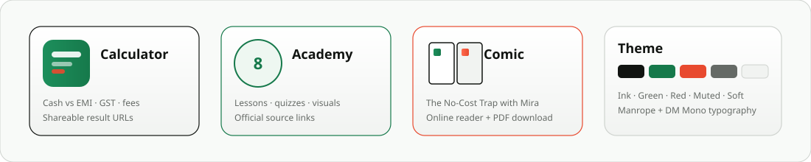
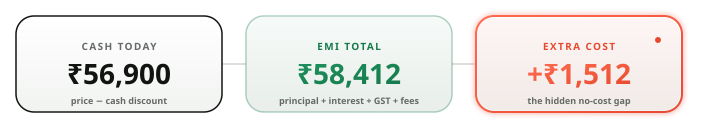
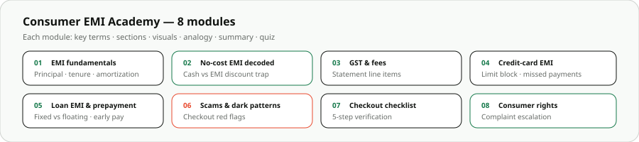
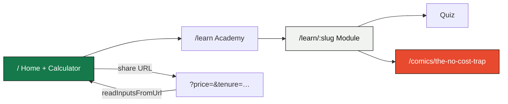

<p align="center">
  
</p>

<p align="center">
  A <strong>India-first finance education site</strong> built with <strong>React</strong>, <strong>Vite</strong>, and deployed on <strong>Vercel</strong>.
</p>

<p align="center">
  
  
  
  
</p>

<p align="center">
  
  
  
  
</p>

---

## ✦ What is EMI Truth?

EMI Truth helps Indian shoppers **compare paying cash today vs choosing EMI** — including interest, GST on interest, processing fees, and the cash discount you may lose. It combines a shareable calculator, an 8-module academy, topic visuals, quizzes, and a portrait comic.

<p align="center">
  
</p>

<table>
  <tr>
    <td width="50%" valign="top">

### 🧮 True EMI Calculator
- **Reducing-balance EMI** math with month-by-month schedule
- Inputs: price, cash discount, EMI discount, rate, tenure, fees, GST%
- Outputs: **cash cost**, **EMI total**, **extra cost** difference
- **Shareable URLs** — calculator state encoded in query params
- Runs 100% in the browser — no login, no API

    </td>
    <td width="50%" valign="top">

### 📚 Consumer EMI Academy
- **8 modules** from EMI basics → scams → consumer rights
- Each module: key terms, sections, analogy, summary
- **Topic visuals** in `public/visuals/` (8 storyboard diagrams)
- **End-of-module quizzes** with explanations
- Links to **official RBI / consumer sources**

    </td>
  </tr>
  <tr>
    <td width="50%" valign="top">

### 📖 The No-Cost Trap Comic
- Portrait comic starring **Mira** — 4 pages + cover
- **Page-flip reader** with spread navigation
- Glossary primer before reading
- **PDF download** at `/books/the-no-cost-trap/the-no-cost-trap.pdf`
- Tied to the no-cost EMI learn module

    </td>
    <td width="50%" valign="top">

### 🇮🇳 India-Specific Context
- Rupee formatting (`en-IN`) throughout
- GST on EMI interest & processing fees
- No-cost checkout patterns & dark flags
- Card-limit blocking & prepayment trade-offs
- Educational only — **not financial advice**

    </td>
  </tr>
</table>

---

## ✦ Calculator Logic

<p align="center">
  
</p>

**Formula flow:** `financed = price − emiDiscount` → reducing-balance EMI schedule → add GST on interest + processing fee + fee GST → compare against `price − cashDiscount`.

**Default demo inputs:** ₹59,900 price · 6-month tenure · 15% rate · 18% GST · ₹299 processing fee.

---

## ✦ Academy Modules

<p align="center">
  
</p>

| # | Route | What's inside |
|---|-------|---------------|
| 01 | `/learn/emi-basics` | Principal, interest, tenure, amortization visual |
| 02 | `/learn/no-cost-emi` | Cash vs EMI discount, money-flow diagram |
| 03 | `/learn/gst-and-fees` | GST on interest, processing fees, penal charges |
| 04 | `/learn/credit-card-emi` | Limit blocking, missed payment costs |
| 05 | `/learn/loan-emi` | Fixed vs floating, prepayment choices |
| 06 | `/learn/emi-scams` | Scam red flags, misleading checkout patterns |
| 07 | `/learn/checkout-checklist` | 5-step pre-checkout verification |
| 08 | `/learn/consumer-rights` | Complaint escalation visual & sources |

---

## ✦ App Flow



---

## ✦ Tech Stack

<table>
  <thead>
    <tr>
      <th>Layer</th>
      <th>Technology</th>
      <th>Purpose</th>
    </tr>
  </thead>
  <tbody>
    <tr><td>⚛️ UI</td><td>React 19</td><td>Calculator, academy, comic reader</td></tr>
    <tr><td>⚡ Build</td><td>Vite 6 + Terser</td><td>Fast dev, minified production bundle</td></tr>
    <tr><td>🧮 Logic</td><td><code>calculator.js</code></td><td>EMI math, URL share encoding</td></tr>
    <tr><td>📖 Content</td><td><code>learnData.js</code></td><td>Modules, quizzes, official sources</td></tr>
    <tr><td>🎨 Styling</td><td>Custom CSS</td><td>Manrope + DM Mono design system</td></tr>
    <tr><td>☁️ Host</td><td>Vercel</td><td>CDN, SSL, SPA rewrites, security headers</td></tr>
    <tr><td>📊 Analytics</td><td>Vercel Analytics + Speed Insights</td><td>Traffic & Core Web Vitals</td></tr>
    <tr><td>💰 Ads</td><td>Google AdSense</td><td>Meta tag, script, <code>ads.txt</code></td></tr>
  </tbody>
</table>

### Design Tokens

| Token | Value | Usage |
|-------|-------|-------|
| `ink` | `#111411` | Text, borders |
| `green` | `#16794b` | Brand, CTAs, trust |
| `red` | `#e84a2f` | GST, warnings, extra cost |
| `muted` | `#656a66` | Secondary copy |
| `soft` | `#f1f3f1` | Panels, surfaces |
| `principal` | `#151815` | Calculator breakdown bar |
| `interest` | `#777e78` | Calculator breakdown bar |
| `heading` | Manrope | UI & display |
| `mono` | DM Mono | Numbers & labels |

---

## ✦ Project Structure

```
Emi-Truth/
├── assets/readme/              # README SVG visuals + logo
│   ├── logo.jpeg               # Brand mark (₹ + lens)
│   ├── banner.svg              # Premium hero banner
│   ├── features.svg            # 4-card feature overview
│   ├── academy.svg             # 8-module grid
│   ├── calculator-breakdown.svg
│   └── footer.svg
├── public/
│   ├── visuals/                # 8 learn-module diagrams
│   ├── books/the-no-cost-trap/ # Comic pages + PDF
│   ├── comics/no-cost-trap/    # Scene art assets
│   ├── characters/             # Mira reference
│   ├── logo.jpeg
│   └── ads.txt
├── src/
│   ├── App.jsx                 # Home, Learn, Module, Comic pages
│   ├── calculator.js           # EMI engine + URL sharing
│   ├── learnData.js            # All content & quizzes
│   ├── styles.css              # Full design system
│   └── main.jsx
├── vercel.json                 # SPA rewrites + cache + security headers
└── index.html                  # AdSense verification tags
```

---

## ✦ Getting Started

### Prerequisites

- **Node.js** 18+
- **npm**

### 1 · Clone & install

```bash
git clone https://github.com/peterish8/Emi-Truth.git
cd Emi-Truth
npm install
```

### 2 · Run locally

```bash
npm run dev
```

Open `http://localhost:5173` — no `.env` required.

### Build commands

| Command | Description |
|---------|-------------|
| `npm run dev` | Vite dev server |
| `npm run build` | Production build → `dist/` |
| `npm run preview` | Preview production build |
| `npm run lint` | ESLint |
| `npm run security:vercel` | Apply WAF rules (needs `vercel link`) |

---

## ✦ Deploy on Vercel

1. Connect GitHub repo — preset **Vite**
2. Build: `npm run build` · Output: `dist`
3. Add `emitruth.in` + `www.emitruth.in`
4. Enable **Analytics** + **Speed Insights**
5. Firewall → **Bot Protection → Challenge**

`vercel.json` rewrites all routes to `index.html` so `/learn/*` and `/comics/*` work on direct visits.

---

## ✦ Disclaimer

Educational content only — **not financial advice**. Always verify offer terms with your bank or seller before borrowing.

---

<p align="center">
  
</p>