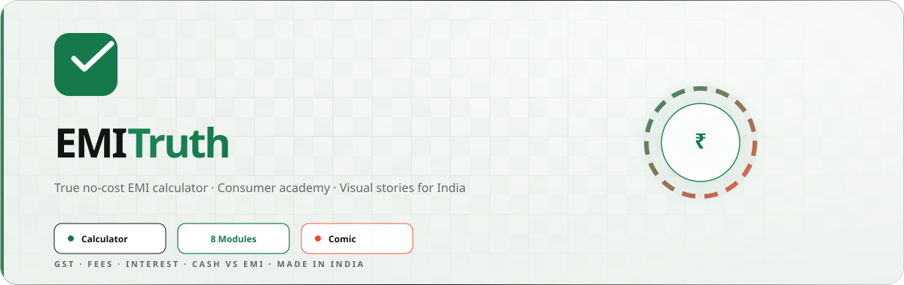
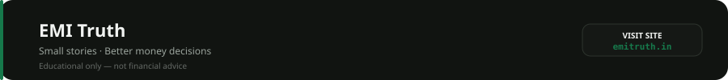

<p align="center">
  
</p>

<h1 align="center">💚 EMI Truth</h1>

<p align="center">
  <b>See what no-cost really costs.</b><br>
  Calculator · Consumer Academy · Comic · India-first finance education
</p>

<p align="center">
  <a href="https://www.emitruth.in"></a>
  <a href="https://www.emitruth.in/#calculator"></a>
  <a href="https://www.emitruth.in/learn"></a>
</p>

<hr>

<h2 align="center">✨ What You Get</h2>

<p align="center">
  
</p>

<p align="center">
  🧮 <b>Calculator:</b> Compare cash price vs true EMI — interest, GST, fees & lost discounts<br><br>
  📚 <b>Academy:</b> 8 modules from EMI basics to scams, GST, prepayment & consumer rights<br><br>
  📖 <b>Comic:</b> <i>The No-Cost Trap</i> — portrait story with Mira + PDF download<br><br>
  🎯 <b>Quizzes:</b> End-of-module checks so concepts actually stick<br><br>
  🇮🇳 <b>India-first:</b> Rupees, GST, no-cost checkout patterns & local context
</p>

<hr>

<h2 align="center">🗺️ Routes</h2>

<p align="center">
  <code>/</code> Calculator &nbsp;·&nbsp;
  <code>/learn</code> Academy &nbsp;·&nbsp;
  <code>/learn/no-cost-emi</code> No-cost decoded &nbsp;·&nbsp;
  <code>/comics/the-no-cost-trap</code> Comic reader
</p>

<table align="center">
  <tr>
    <td align="center"><code>/learn/emi-basics</code></td>
    <td align="center"><code>/learn/no-cost-emi</code></td>
    <td align="center"><code>/learn/gst-and-fees</code></td>
    <td align="center"><code>/learn/credit-card-emi</code></td>
  </tr>
  <tr>
    <td align="center"><code>/learn/loan-emi</code></td>
    <td align="center"><code>/learn/emi-scams</code></td>
    <td align="center"><code>/learn/checkout-checklist</code></td>
    <td align="center"><code>/learn/consumer-rights</code></td>
  </tr>
</table>

<hr>

<h2 align="center">🚀 Quick Start</h2>

```bash
git clone https://github.com/peterish8/Emi-Truth.git
cd Emi-Truth
npm install
npm run dev
```

<p align="center">
  Open <code>http://localhost:5173</code> — no backend, no <code>.env</code> needed.
</p>

<table align="center">
  <tr>
    <td align="center"><code>npm run dev</code><br><sub>Local dev</sub></td>
    <td align="center"><code>npm run build</code><br><sub>→ dist/</sub></td>
    <td align="center"><code>npm run preview</code><br><sub>Prod preview</sub></td>
    <td align="center"><code>npm run lint</code><br><sub>ESLint</sub></td>
  </tr>
</table>

<hr>

<h2 align="center">💻 Tech Stack</h2>

<table align="center">
  <tr>
    <td align="center"></td>
    <td align="center"></td>
    <td align="center"></td>
    <td align="center"></td>
    <td align="center"></td>
    <td align="center"></td>
    <td align="center"></td>
    <td align="center"></td>
  </tr>
</table>

<p align="center">
  <b>Also wired:</b> Vercel Web Analytics · Speed Insights · Google AdSense · SPA rewrites
</p>

<hr>

<h2 align="center">🎨 Brand Palette</h2>

<p align="center">
  
  
  
  
  
</p>

<hr>

<h2 align="center">📁 Project Structure</h2>

```
Emi-Truth/
├── assets/readme/       # README banner, features & footer SVGs
├── public/              # visuals · books · comics · ads.txt
├── src/
│   ├── App.jsx          # Pages & comic reader
│   ├── calculator.js    # EMI math + share URLs
│   ├── learnData.js     # Modules, quizzes, sources
│   └── styles.css       # Design system
├── vercel.json          # SPA rewrites + security headers
└── index.html
```

<hr>

<h2 align="center">☁️ Deploy on Vercel</h2>

<p align="center">
  🔗 Connect GitHub repo → Framework: <b>Vite</b> → Build: <code>npm run build</code> → Output: <code>dist</code><br><br>
  🌍 Add domains <code>emitruth.in</code> + <code>www.emitruth.in</code><br><br>
  📊 Enable <b>Analytics</b> + <b>Speed Insights</b> in dashboard<br><br>
  🛡️ Turn on <b>Bot Protection → Challenge</b> in Firewall
</p>

<hr>

<h3 align="center">⚠️ Disclaimer</h3>

<p align="center">
  Educational content only — <b>not financial advice</b>.<br>
  Always verify offer terms with your bank or seller before borrowing.
</p>

<hr>

<p align="center">
  
</p>